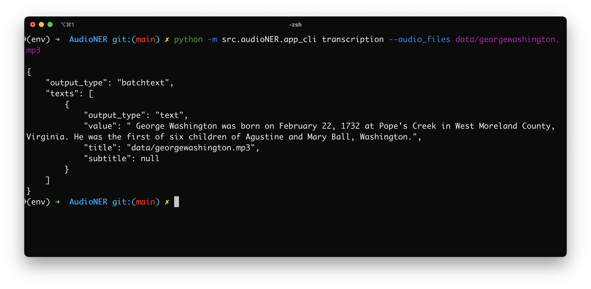
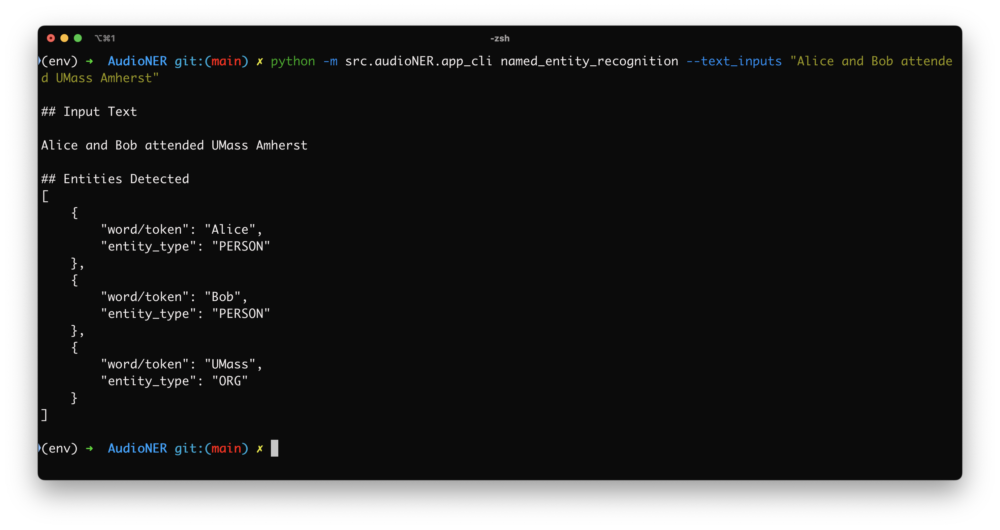
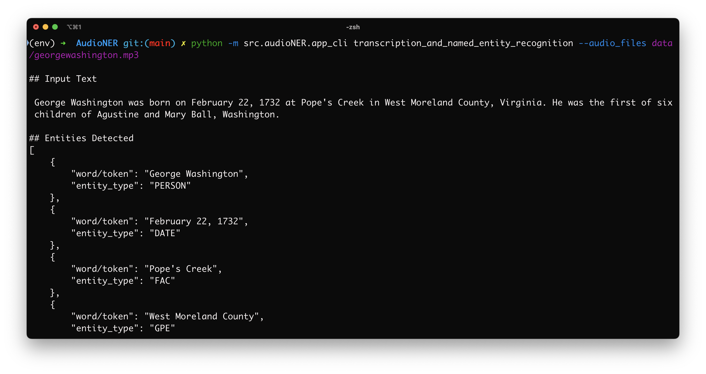

# Introduction

AudioNER helps users extract named entities from Audio files. Named entities include such as names of PERSONS, ORGANIZATIONS, LOCATIONS, FACILITIES like bridges or highways, LANGUAGE etc. (see full list on [SpaCy documentation](https://spacy.io/models/en#en_core_web_sm))


# Getting started

##  Installation

Follow the below steps to setup the repository locally and install necessary dependencies.

1. Set up a Python 3 virtual environment using [Conda](https://docs.conda.io/projects/conda/en/latest/user-guide/install/index.html#) or [Virtualenv](https://virtualenv.pypa.io/en/latest/index.html).
    - Python version used for this project is 3.10
2. Activate your virtual environment.
3. Set up the repository locally

```
git clone https://github.com/anjus1313/AudioNER.git
```
4. Jump into the cloned repository
```
cd AudioNER
```
5. Install dependencies
```
pip install -r requirements.txt
```
**FFMPEG**: This project also requires the use of ffmpeg library for audio file processing. Install that using [this guideline](https://www.geeksforgeeks.org/how-to-install-ffmpeg-on-windows/) for Windows OS and [this guideline](https://phoenixnap.com/kb/ffmpeg-mac) for Mac OS.

# Usage

## CLI

Test using your audio files via CLI (command line interface)

```
python -m src.audioNER.app_cli --help
```

### Subcommand 1: Transcribe Audio Files

```
python -m src.audioNER.app_cli transcription --audio_files data/georgewashington.mp3
```




### Subcommand 2: NER from a collection of text inputs

```
python -m src.audioNER.app_cli named_entity_recognition --audio_files data/georgewashington.mp3
```



### Subcommand 3: Transcribe Audio Files and NER

```
python -m src.audioNER.app_cli transcription_and_named_entity_recognition --audio_files data/georgewashington.mp3
```




## Server

Start the server with:

```
python src/audioNER/app_server.py
```
